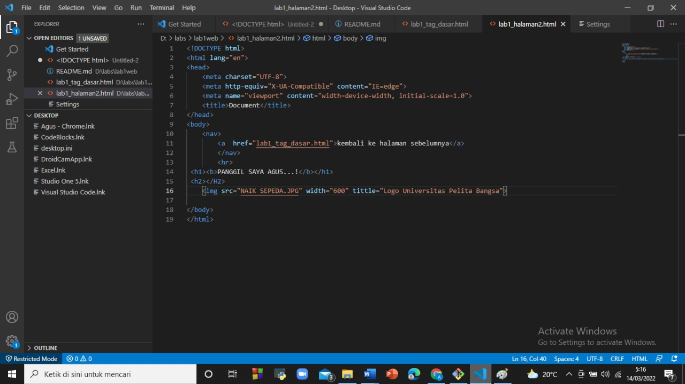

# lab1web
## Belajar tag dasar html

### Membuat paragraf
kode tag untuk paragraf adalah 

#### Membuat judul
kode tag untuk judul <h1>

##### Memformat teks
kode tag unutk memformat teks <b> <i> <mark> <strong>

###### Menambah gambar
kode tag untuk menambah gambar 

###### Menambah hyperlink
kode tag untuk menambah hyperlink <a  href="halaman2.html">Halaman  2</a>
